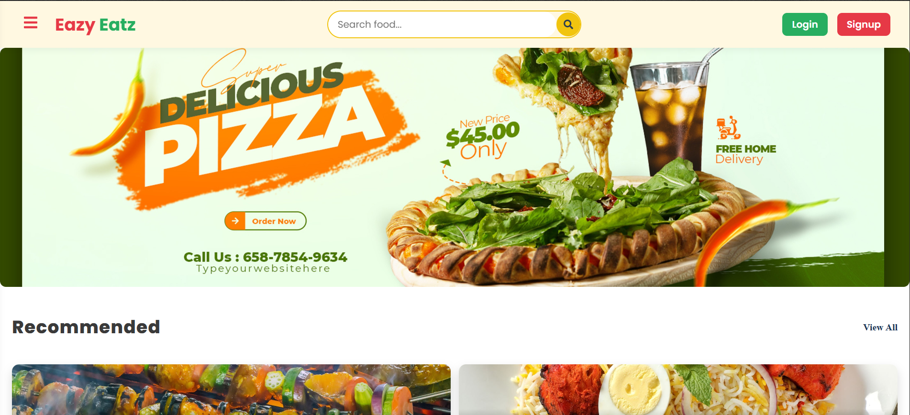
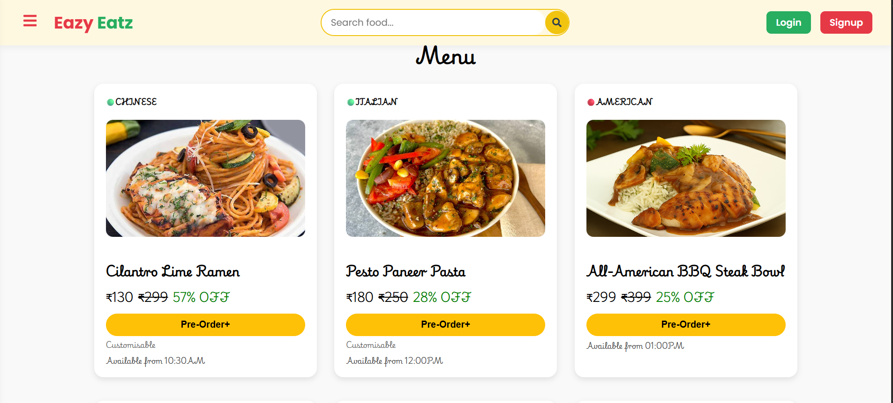
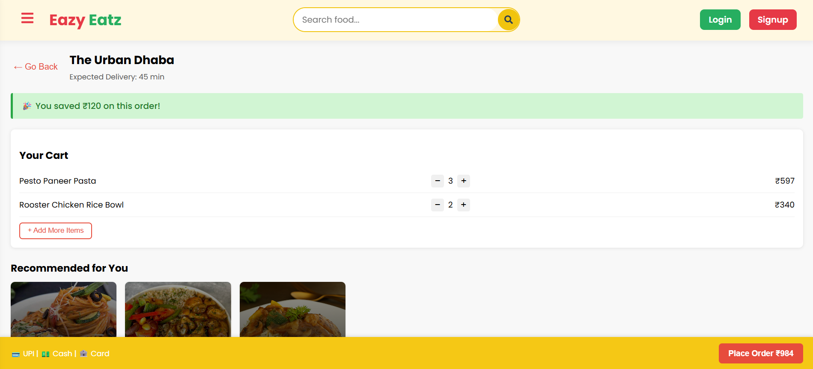

# 🍔 Eazy Eatz - Food Ordering Frontend

Welcome to **Eazy Eatz**, a responsive and visually appealing frontend project built using **ReactJS**. This app mimics a modern food delivery platform with category browsing, recommendations, item selection, and billing summary interface.  

---

## 🔥 Features

- 🎯 Interactive **Category Menu**
- 🍕 Beautifully designed **Food Cards**
- ⭐ Ratings, Prices & Restaurant Info
- ➕ Add to Cart functionality
- 🧾 Structured **Bill Summary**
- 🧭 Change Address section
- 🌄 Background image support with opacity overlay
- 📱 Fully responsive layout

---

## 🖼️ Screenshots

   
   
    

---

## 📦 How to Use

1. **Clone the repository**

`git clone https://github.com/Daksh-Official/eazy-eatz.git`

2. **Navigate into the project folder**

`cd eazy-eatz`

3. **Install dependencies**

`npm install`

4. **Start the Devlopment Server**

`npm start`

🚀 Future Enhancements

-> Add cart functionality with local storage or Redux 
->Integrate backend APIs 
->Add user login system 
->Add animations and transitions 

🙌 Contributing
Pull requests are welcome. For major changes, please open an issue first to discuss what you would like to change.

💬 A Personal Note
This project was made with passion, coffee ☕, and the aim to learn ReactJS through real-world UI development.
If you found this helpful, feel free to ⭐ the repo or drop a message! I'd love to connect and collaborate.
Thanks for stopping by! 🚀

Made with ❤️ by Daksh Gupta

## 📬 Contact

Feel free to connect with me on [LinkedIn](https://www.linkedin.com/in/daksh-gupta-6a4816262/) or [email](daksh.official9705@gmail.com)
